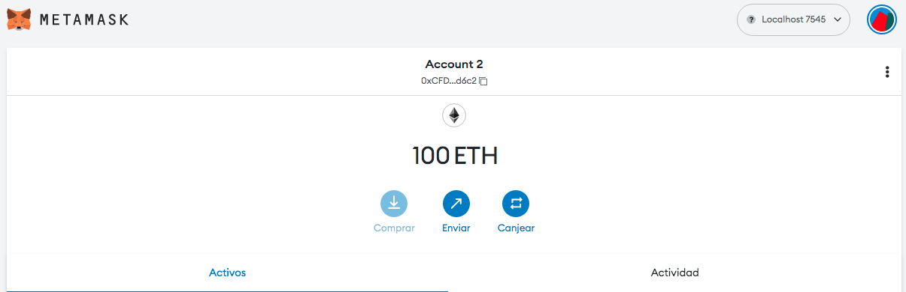

# Gestor de Tareas Descentralizado

Aplicación descentralizada de gestión de tareas con Blockchain, Solidity y JS.


## Stack tecnológico

- [Visual Studio Code](https://code.visualstudio.com/), como IDE para desarrollar la solución.
- [Extensión Visual Studio Code Solidity](https://marketplace.visualstudio.com/items?itemName=JuanBlanco.solidity), como extensión para desarrollar sobre el IDE anterior código en [Solidity](https://solidity-es.readthedocs.io/es/latest/).
- [Truffle Framework](https://trufflesuite.com/), como framework de desarrollo para _smart contracts_ (contratos inteligentes) .
- [Ganache](https://trufflesuite.com/ganache/), como red de pruebas Ethereum en local. 
- [Metamask](https://metamask.io/), como extensión del navegador que permite conexión directa con aplicaciones descentralizadas de la red Ethereum.
- [NodeJS](https://nodejs.org/en/), como entorno de servidor para desplegar el cliente que interactuará con la solución descentralizada.

## Enunciado

Vamos a crear una aplicación distribuida que simule ser un gestor de tareas. Para ello, vamos a apoyarnos en un lenguaje de programación llamado [Solidity](https://solidity-es.readthedocs.io/es/latest/) para desarrollar un contrato inteligente que nos permita crear tareas y cambiarles el estado (hecho/no hecho) usando la blockchain de Ethereum.

Desde una ventana de comando, vamos a instalar [Truffle](https://trufflesuite.com/):

    $ npm install -g truffle

Una vez instalado, vamos a crear la carpeta que contendrá el contrato inteligente de la aplicación e iniciamos [Truffle](https://trufflesuite.com/):

    $ truffle init 

Y generamos nuestro primer contrato inteligente:

    $ truffle create contract ContratoTareas

Esto nos creará un fichero _ContratoTareas.sol_ que contendrá la lógica de nuestro contrato.

```js
// SPDX-License-Identifier: MIT
pragma solidity >=0.4.22 <0.9.0;

contract ContratoTareas {

  uint256 public contadorTareas = 0;

  struct Tarea{
      uint256 id;
      string titulo;
      string descripcion;
      bool estado;
      uint256 fechaCreacion;
  }

  event TareaCreada(
        uint256 id,
        string titulo,
        string descripcion,
        bool estado,
        uint256 fechaCreacion
  );

  event TareaCambiarEstado(uint256 id, bool estado);

  mapping(uint256 => Tarea) public tareas;

  constructor() {
    crearTarea("Mi primera tarea", "Esta es la descripcion de mi primera tarea");
  }
  
  function crearTarea(string memory _titulo, string memory _descripcion)
        public
    {
        contadorTareas++;
        tareas[contadorTareas] = Tarea(
            contadorTareas,
            _titulo,
            _descripcion,
            false,
            block.timestamp
        );
        emit TareaCreada(
            contadorTareas,
            _titulo,
            _descripcion,
            false,
            block.timestamp
        );
    }

    function cambiarEstadoTarea(uint256 _id) public {
        Tarea memory _tarea = tareas[_id];
        _tarea.estado = !_tarea.estado;
        tareas[_id] = _tarea;
        emit TareaCambiarEstado(_id, _tarea.estado);
    }

}
```

Una vez creado, nos situamos en la carpeta _migrations_ y crearemos un fichero con el nombre _`1_deploy_ContratoTareas.js`_ con el siguiente contenido:

```js
const ContratoTareas = artifacts.require("ContratoTareas.sol");

module.exports = function (deployer) {
  deployer.deploy(ContratoTareas);
};
```

Para desplegar nuestro contrato en nuestra red local de pruebas de Ethereum vamos a usar [Ganache](https://trufflesuite.com/ganache/). Lo arrancamos y creamos una red:


Elegimos la opción _Quickstart Etherum_:


Con esto tenemos la red creada, con 10 cuentas que tienen un saldo de 100.00 ETH. Tenemos que fijarnos en el puerto donde se ha levantado al red:


En este caso, es el puerto **_7545_**. Este valor lo usaremos mas adelante (para configurar [Truffle](https://trufflesuite.com/) y [Metamask](https://metamask.io/))

Con la red creada, vamos a configurar [Truffle](https://trufflesuite.com/) para que use esta red. Para ello, en el fichero _truffle-config.js_, descomentamos las propiedades del apartado _network_ para que el puerto coincida con el que nos da [Ganache](https://trufflesuite.com/ganache/):

```js
development: {
     host: "127.0.0.1",     // Localhost (default: none)
     port: 7545,            // Standard Ethereum port (default: none)
     network_id: "*",       // Any network (default: none)
    },
};
```
Ya con todo listo, vamos a compilar, empaquetar y desplegar nuestro contrato inteligente:

    $ truffle deploy

Si todo ha ido bien, veremos el resultado de la operación (y su coste):


Con el contrato inteligente en la red, vamos a configurar [Metamask](https://metamask.io/) para poder interactuar desde nuestro navegador con la red. Para ello, vamos a la URL y pulsamos _Download for_ 


Añadimos la extensión:


Al finalizar la instalación, se abre una nueva pestaña solicitandonos información. Seleccionamos _Crear una cartera nueva_:


Ayudamos a mejorar Metamask enviando de forma anónima los datos de uso:


Creamos una contraseña y aceptamos los terminos:


No es necesario proteger nuestra cuenta, seleccionamos _Recordarme más tarde (no recomendado)_:


Si todo ha ido bien, hemos creado la cuenta en [Metamask](https://metamask.io/):


Para facilitar su uso, anclamos la extensión al navegador:


[Metamask](https://metamask.io/) viene preparado para interactuar con la red principal de Etherum. Vamos a cambiarlo para que use la red que tenemos en local mediante [Ganache](https://trufflesuite.com/ganache/). Para ello, pulsamos _Agregar red_:


En el menú de configuración, seleccionamos _Redes_:


Y de ellas, seleccionamos la red _Localhost 8545_ y cambiamos el puerto al que nos da [Ganache](https://trufflesuite.com/ganache/) y que hemos obtenido antes (**_7545_**)


Una vez configurado [Metamask](https://metamask.io/) para que use la red local de [Ganache](https://trufflesuite.com/ganache/), nos queda importar una de las cuentas. Para ello, vamos a la opción _Mis Cuentas_ y seleccionamos la opción _Importar cuenta_:


Necesitamos una clave privada:


Para ello, vamos a [Ganache](https://trufflesuite.com/ganache/) y en el icono de la llave de cualquiera de los usuarios:


Obtenemos su clave privada


La copiamos y la ponemos en [Metamask](https://metamask.io/):


Ya tenemos una cuenta de nuestra red local de Etherum con saldo lista para usar:



Con [Metamask](https://metamask.io/) instalado y configurado, vamos a usar una aplicación desarrollada en JS y que mediante NodeJS nos sirva de interfaz para usar el contrato inteligente que tenemos en nuestra red Etherum de pruebas situada en local.

Descargaremos los paquetes necesarios para que funcione la aplicación:

    $ npm install

Una vez que este todo descargado, lanzaremos la aplicación:

    $ npm run dev


Y accediendo a la URL [http://localhost:3001](http://localhost:3001) podremos ver la aplicación y comprobar si nuestro contrato inteligente funciona correctamente.